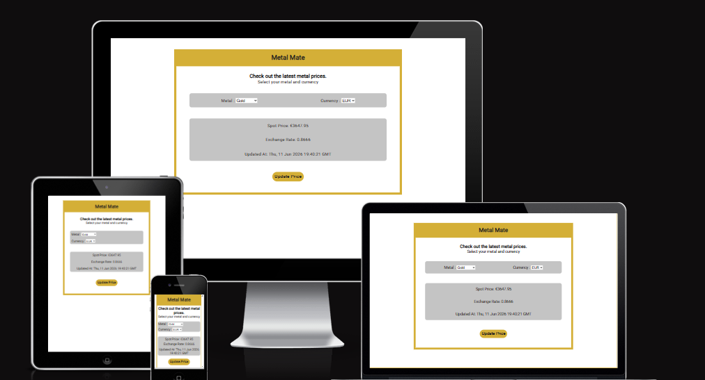
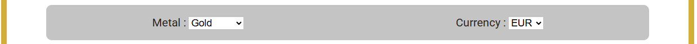
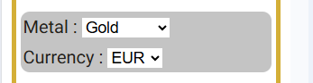
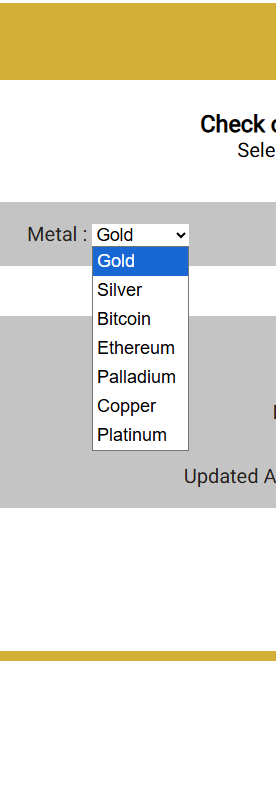
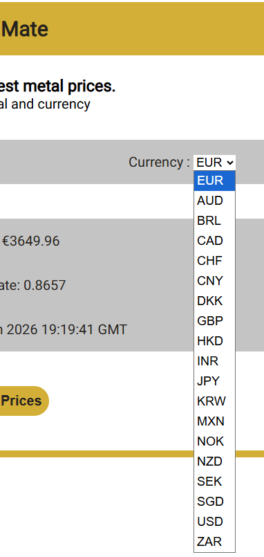
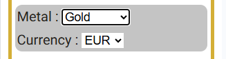
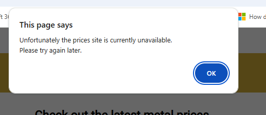

# Metal Mate Javascript Project
Website to view the latest metal prices

This project is to build a website which displays the latest metal prices for a chosen metal in the chosen currency.
It is a fully responsive site written in just HTML, CSS and Javascript.
The purpose of this project was to add a more recent Javascript project to my portfolio and practise my JavaScript skills.

The site uses an API from gold-api.com to provide the metal prices - https://api.gold-api.com/price/{symbol}/{?currency}.

It also retrieves all available symbols from this api site using the https://api.gold-api.com/symbols endpoint and adds them to the 
drop-down list. 

These API's are provided free and you can see the documentation [here](https://gold-api.com/docs).

# Features 

The site consists of a single page with a large heading, a motivational area, a preference area and a price area. 

The currencies for the drop down are loaded from an array on first visiting the site and the first on the list 'EUR' is set as the default selection.  

The metals for the drop down are loaded from the symbols end-point of the gold-api.com API also on first visiting the site.
Gold is loaded first so that it is the default value selected on entry. 

The price information is then retrieved on entry for the defaults once retrieved from the API. 

There are event listeners added to both drop downs so that if either the currency or metal selection is changed the 
price details will automatically be retrieved and displayed.

It also has a button control to re-retrieve the same selection price details.

## Existing Features

- __The Metal Mate Heading__

  - Featured at the top of the page, the Metal Mate heading is easy to see for the user and sets the style of the site.

  - __The Motivational Area__

    - This section will display a message to explain to users the point of the site and explain how they can interact with it.

- __The Preferences Area__

  - This section allows the user to select the metal/symbol of preference and the currency. 
  - The options stack on top of each other on small screens like phones.

- __The Price Area__

  - This section will display the information returned from the API. 
  
  - This includes the current spot price for the chosen metal, the current exhange rate to the dollar and the date it was last updated in GMT time.

  

  

- __The Button section__

  - The button in this section allows users to refresh the price details of the current preferences.

 

# Technologies used

## Languages
* HTML
* CSS
* Javascript

## Libraries & Framework
* [Google Fonts](https://fonts.google.com/ "Google Fonts")
  The font I used was Roboto from Google Fonts [Roboto](https://fonts.google.com/?query=Roboto "Roboto") which I felt gave the site a clean look. 

## Tools
* [gold-api.com](https://gold-api.com/ "GOLD PRICE API")

# Testing 

To test this site I did the following:-
First I tested the site on a mobile device and then on a tablet and laptop.
1) Clicked the site url in github - https://evelynfoy.github.io/metal-mate-javascript-project/
   The site appeared quickly and looked well.
   The metal dropdown defaulted correctly to gold and displayed other options from the API on clicking.
   The currency dropdown defaulted correctly to EUR and displayed other options from the array on clicking.
   The preferences were stacked one over the other correctly and the styling adjusted correctly to facilitate a smaller screen.
2) The price information appeared immediately on load of the site and was correct for the default preferences.
3) I changed the metal preference to 'Silver' and the price information updated immediately to the correct value for 'Silver'.
4) I changed the currency preference to 'JPY' and the price information updated immediately to the correct value for 'Silvr' in Japanese Yen.
5) The correct symbol for yen appeared before the Spot Price.
6) The Spot Price displayed correctly formated to 2 decimal places.
7) After 5 mins I clicked the Update Prices button and the display updated with the latest price and 'Updated At' value.

I continue to test choosing different currencies and metals and found the site pleasing and easy to use.

I am satisfied with the results

I then tested the error processing by changing the name of the url for the APIs to be incorrect.
It displayed an alert informing me that the prices site was currently unavailable and that I should try again later.
The button was disabled correctly preventing confusion.

### Validator Testing 

- HTML
    - No errors were returned when passing through the official [W3C validator](https://validator.w3.org/nu/?doc=https%3A%2F%2Fevelynfoy.github.io%2Fmetal-mate-javascript-project%2F)
    - See [Results](docs/images/htmlValidatorResult.png)
- CSS
    - No errors were found when passing through the official [(Jigsaw) validator](https://jigsaw.w3.org/css-validator/validator?uri=https%3A%2F%2Fevelynfoy.github.io%2Fmetal-mate-javascript-project%2F&profile=css3svg&usermedium=all&warning=1&vextwarning=&lang=en)
    - See [Results](docs/images/cssValidatorResult.png)
- JavaScript
    - No errors were found when passing through the official [Jshint validator](https://jshint.com/)
    - See [Results](docs/images/jsHintResults.png)
- Lighthouse Report
    - Accessibility score 100
    - See [Results](docs/images/LightHouseResults.png)

# Deployment

I created a repository in github for this project https://github.com/evelynfoy/metal-mate-javascript-project
I then used the Visual Studio Code editor to build it.

- The site was deployed to GitHub pages. The steps to deploy are as follows: 
  - In the GitHub repository, navigate to the <b>Settings</b> tab 
  - Then click the <b>Pages</b> tab.
  - From the source section drop-down menu, select the <b>Main</b> Branch
  - Once the master branch has been selected, the page will be automatically refreshed with a link to the deployed site. 

The live link can be found here - https://evelynfoy.github.io/metal-mate-javascript-project/

For local deployment 
  - Go to https://github.com/evelynfoy/metal-mate-javascript-project
  - Click <b>Code</b> button
  - You can then choose to <b>Open with GitHub Desktop</b>, <b>Open with Visual Stuio</b> or <b>Download the source</b> as a zip file.
  - If you download the zip file, you can extract the contents to a folder of your choice and open the source using any editor e.g Visual Studio Code

  # Credits 

For code inspiration, help and advice,
* [Gold Price API](https://gold-api.com/ "Gold Price API") For information on the API on which the functionality of this site is based.
* [Stack Overflow](https://stackoverflow.com/questions/6134039/format-number-to-always-show-2-decimal-places) For various coding assistance.
* [WebAIM](https://webaim.org/resources/contrastchecker/) Helped me choose good colour combinations for accessability.